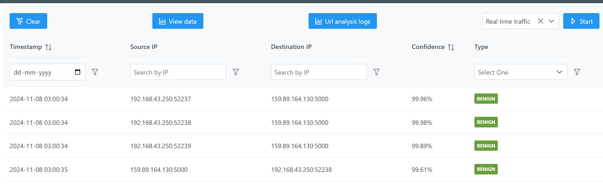

# ML-Based Network Traffic Analyzer 🚀

**Tech Stack:** Flask, Vue.js, XGBoost, Scapy, Wireshark, CICDDoS2019 Dataset

A **machine learning-powered system** to classify live network traffic and `.pcap` files as **benign or malicious** with **confidence scores**.  
Users can filter traffic by protocol (e.g., UDP Null), either analyzing pre-recorded `.pcap` files or capturing live traffic from their device in real time.

---

## 🌟 Features

- **Live Traffic Capture:** Real-time packet sniffing using Scapy.  
- **PCAP File Analysis:** Analyze `.pcap` files and validate model predictions using Wireshark.
- 
- **Protocol-Based Filtering:** Apply filters (UDP, LDAP, MSSQL, SYN, etc.) to generate predictions for live traffic or `.pcap` files.  
- **ML-Powered Detection:** XGBoost model trained on **CICDDoS2019 dataset** for multi-class attack detection (DDoS, SQLi, XSS).  
- **Confidence Scores:** Display confidence for each classification alongside benign/malicious labels.  
- **Interactive Dashboard:** Visualize traffic patterns, simulate attacks, and export logs for forensic analysis.  

---

## 🛠 How It Works

1. **Select Traffic Source:**  
   - `.pcap` file → Load pre-recorded network traffic.
   -   
   - Live traffic → Capture packets directly from your device using Scapy.
   - 

2. **Apply Protocol Filter:**  
   - Choose protocols like UDP Null, LDAP, MSSQL, SYN, etc.  

3. **Model Prediction:**  
   - The system uses the selected `.pcap` file or live traffic to generate predictions.  
   - Outputs **benign/malicious labels** with **confidence scores**.  

4. **Dashboard Visualization:**  
   - View filtered traffic, attack simulations, and exportable logs for analysis.  

---

## ⚡ Installation

```bash
# Clone the repository
git clone https://github.com/your-username/ml-network-traffic-analyzer.git
cd ml-network-traffic-analyzer

# Create a virtual environment
python -m venv venv
source venv/bin/activate   # Linux/Mac
venv\Scripts\activate      # Windows

# Install backend dependencies
pip install -r requirements.txt

# Frontend setup
cd frontend
npm install
npm run serve

# Run backend
cd ../backend
python app.py
